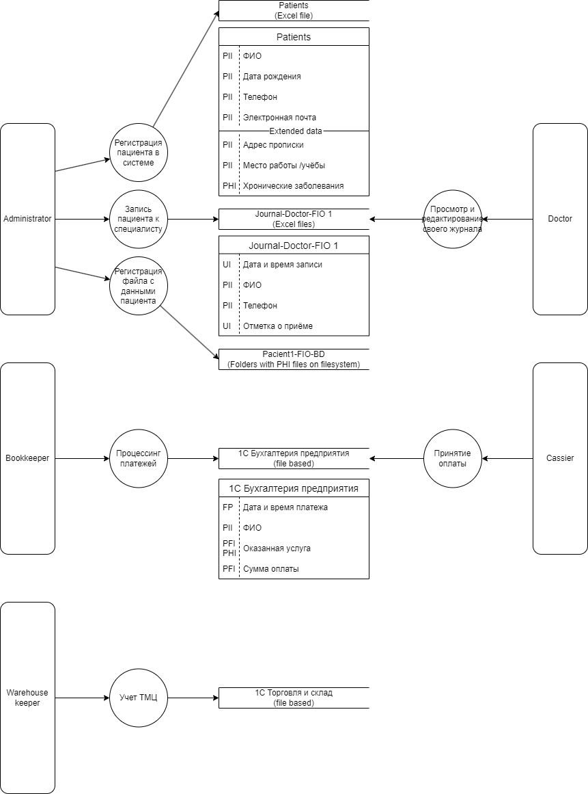

# Cписок проблемных зон

Ниже приводится перечень идентифицированных проблем по результатам аудита мер по обеспечению безопасности данных согласно разработанной DFD диаграмме  

Аудит показал, что в компании отсутствуют зрелые процессы по хранению, обработке и обеспечению конфиденциальности информации. Вся информация вводится и сохраняется без использования специализированных систем, в основом используется Microsoft Excel. Excel файлы и файлы с медицинской информации (в других различных форматах) хранится в соответствующих директориях на файловой системе. 

Таким образом, учитывая то, что текущая информационная архитектура построена на принципе работы с файлами с использованием продуктов Microsoft, ниже приводятся рекомендации по мерам в части организации работы с файлами.
Предлагаемые меры направлены на снижение влияния выявленных проблем и улучшения существующей информационной архитектуры до начала внедрения MVP. Учитывая то, что запуск MVP потребует пересмотра идентифицированных проблем и мер по их снижению, Архитектруа MVP, изменения в способах организации/хранения данных приведены в отдельном документе.

| Идентифицированная проблема                                                | Меры по снижению / снятию влияния (Список инструментов, способов и мер, которые позволят обеспечить конфиденциальность данных) |
| -------------------------------------------------------------------------- | ------------------------------------------------------------------------------------------------------------------------------ |
| Сервера размещены локально в необорудованном помещении                     | Оборудовать серверное помещение согласно рекомендациям TIA-942 Rated-2                                                         |
| Файловая система серверов (файла, базы данных)не шифруется                 | Использовать Windows BitLocker для шифрования физических дисков                                                                |
| Excel файлы содержат сенситивную (PII, PHI) информацию                     | Использовать парольную защиту для Excel файлов                                                                                 |
| 1С Бухгалтерия / предприятие работают в файловом режиме                    | Перейти на клиент-серверную архитектуру                                                                                        |
| Отсутствует разделение прав при доступе к файлам                           | Реализовать RBAC политики по доступу к файлам и директориям доступу                                                            |
| Для идентификации пациента используются перс. данные (ФИО и дата рождения) | Присвоить каждому пациенту уникальный ID использовать его в работе врачей и бухгалтерии                                        |

# Cписок данных для защиты
| Unprotected Information      |
| :--------------------------- |
| Дата и время записи на прием |
| Отметка о приёме             |

| PII - Personally Identifiable Information |
| :---------------------------------------- |
| ФИО                                       |
| Дата рождения                             |
| Телефон                                   |
| Электронная почта                         |
| Адрес прописки                            |
| Место работы /учёбы                       |

| PHI - Protected health information                 |
| :------------------------------------------------- |
| Хронические заболевания                            |
| Различные файлы, содержащие медицинскую информацию |
| Оказанная услуга                                   |

| PFI - Protected finance information |
| :---------------------------------- |
| Оказанная услуга                    |
| Сумма оплаты                        |
| Информация о ТМЦ                    |
